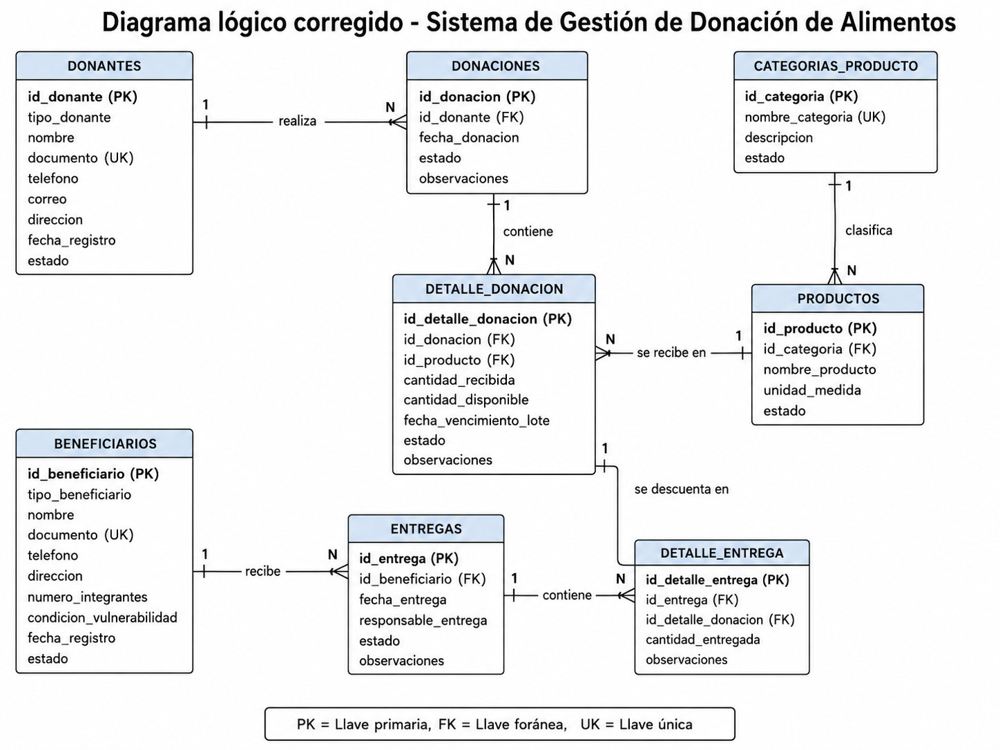

# Modelo relacional y normalización del Sistema de Gestión de Donación de Alimentos

**Proyecto:** Sistema de Gestión de Donación de Alimentos  
**Tema:** Modelo relacional, llaves primarias, llaves foráneas, cardinalidades y normalización 1FN, 2FN y 3FN  
**Autor base del planteamiento:** Juan Camilo Quintero Atoy  

---

## 1. Objetivo del modelo de base de datos

Diseñar un modelo relacional normalizado que permita registrar, consultar y controlar todo el proceso de donación de alimentos, desde el ingreso de los productos donados hasta su entrega a los beneficiarios.

---

## 2. Alcance del modelo

El modelo de base de datos cubre los siguientes procesos:

1. Registro de donantes.
2. Registro de beneficiarios.
3. Registro de categorías de productos.
4. Registro de productos alimenticios.
5. Registro de donaciones recibidas.
6. Registro del detalle de productos incluidos en cada donación.
7. Registro de entregas realizadas a beneficiarios.
8. Registro del detalle de productos entregados.
9. Control básico de inventario mediante cantidades disponibles.
10. Generación de consultas y reportes básicos.

Quedan fuera del alcance procesos como facturación, contabilidad, transporte, aplicaciones móviles o interfaces gráficas.

---

## 3. Identificación de entidades principales

De acuerdo con la problemática y la solución propuesta, se identifican las siguientes entidades principales:

| Entidad | Descripción |
|---|---|
| Donante | Persona, empresa o fundación que realiza una donación. |
| Beneficiario | Persona o familia que recibe alimentos. |
| CategoriaProducto | Clasificación de los alimentos, por ejemplo granos, lácteos, enlatados o frutas. |
| Producto | Alimento registrado en el sistema. |
| Donacion | Registro general de una donación recibida. |
| DetalleDonacion | Productos y cantidades asociados a una donación. |
| Entrega | Registro general de una entrega realizada a un beneficiario. |
| DetalleEntrega | Productos y cantidades entregados en una entrega. |

---

## 4. Modelo relacional propuesto

### 4.1 Tabla: `donantes`

Esta tabla almacena la información de las personas, empresas o fundaciones que realizan donaciones.

| Campo | Tipo de dato | Llave | Descripción |
|---|---|---|---|
| id_donante | INT | PK | Identificador único del donante. |
| tipo_donante | VARCHAR(30) |  | Tipo de donante: persona, empresa o fundación. |
| nombre | VARCHAR(100) |  | Nombre completo o razón social. |
| documento | VARCHAR(30) | UNIQUE | Documento o NIT del donante. |
| telefono | VARCHAR(20) |  | Número de contacto. |
| correo | VARCHAR(100) |  | Correo electrónico. |
| direccion | VARCHAR(150) |  | Dirección del donante. |
| fecha_registro | DATE |  | Fecha de registro en el sistema. |
| estado | VARCHAR(20) |  | Estado del donante: activo o inactivo. |

**Llave primaria:** `id_donante`  
**Llave única recomendada:** `documento`

---

### 4.2 Tabla: `beneficiarios`

Esta tabla almacena la información de las personas o familias beneficiarias.

| Campo | Tipo de dato | Llave | Descripción |
|---|---|---|---|
| id_beneficiario | INT | PK | Identificador único del beneficiario. |
| tipo_beneficiario | VARCHAR(30) |  | Persona o familia. |
| nombre | VARCHAR(100) |  | Nombre del beneficiario o responsable familiar. |
| documento | VARCHAR(30) | UNIQUE | Documento de identificación. |
| telefono | VARCHAR(20) |  | Número de contacto. |
| direccion | VARCHAR(150) |  | Dirección de residencia. |
| numero_integrantes | INT |  | Cantidad de personas del grupo familiar. |
| condicion_vulnerabilidad | VARCHAR(150) |  | Condición o situación del beneficiario. |
| fecha_registro | DATE |  | Fecha de registro. |
| estado | VARCHAR(20) |  | Estado: activo o inactivo. |

**Llave primaria:** `id_beneficiario`  
**Llave única recomendada:** `documento`

---

### 4.3 Tabla: `categorias_producto`

Esta tabla permite clasificar los productos alimenticios.

| Campo | Tipo de dato | Llave | Descripción |
|---|---|---|---|
| id_categoria | INT | PK | Identificador único de la categoría. |
| nombre_categoria | VARCHAR(80) | UNIQUE | Nombre de la categoría. |
| descripcion | VARCHAR(200) |  | Descripción de la categoría. |
| estado | VARCHAR(20) |  | Estado: activa o inactiva. |

**Llave primaria:** `id_categoria`  
**Llave única recomendada:** `nombre_categoria`

---

### 4.4 Tabla: `productos`

Esta tabla contiene los alimentos que pueden ser donados o entregados.

| Campo | Tipo de dato | Llave | Descripción |
|---|---|---|---|
| id_producto | INT | PK | Identificador único del producto. |
| id_categoria | INT | FK | Categoría a la que pertenece el producto. |
| nombre_producto | VARCHAR(100) |  | Nombre del alimento. |
| unidad_medida | VARCHAR(30) |  | Unidad de medida: kg, unidad, litro, paquete, caja. |
| cantidad_disponible | DECIMAL(10,2) |  | Cantidad actual disponible en inventario. |
| fecha_vencimiento | DATE |  | Fecha de vencimiento del producto, si aplica. |
| estado | VARCHAR(20) |  | Estado: disponible, agotado, vencido o inactivo. |

**Llave primaria:** `id_producto`  
**Llave foránea:** `id_categoria` referencia a `categorias_producto(id_categoria)`

---

### 4.5 Tabla: `donaciones`

Esta tabla registra la información general de cada donación recibida.

| Campo | Tipo de dato | Llave | Descripción |
|---|---|---|---|
| id_donacion | INT | PK | Identificador único de la donación. |
| id_donante | INT | FK | Donante que realizó el aporte. |
| fecha_donacion | DATE |  | Fecha en la que se recibió la donación. |
| estado | VARCHAR(30) |  | Estado: recibida, revisada, almacenada o anulada. |
| observaciones | TEXT |  | Comentarios adicionales. |

**Llave primaria:** `id_donacion`  
**Llave foránea:** `id_donante` referencia a `donantes(id_donante)`

---

### 4.6 Tabla: `detalle_donacion`

Esta tabla representa el detalle de productos incluidos en cada donación.

| Campo | Tipo de dato | Llave | Descripción |
|---|---|---|---|
| id_detalle_donacion | INT | PK | Identificador único del detalle. |
| id_donacion | INT | FK | Donación asociada. |
| id_producto | INT | FK | Producto donado. |
| cantidad | DECIMAL(10,2) |  | Cantidad donada. |
| fecha_vencimiento_lote | DATE |  | Fecha de vencimiento del lote recibido. |
| observaciones | VARCHAR(200) |  | Observaciones del producto recibido. |

**Llave primaria:** `id_detalle_donacion`  
**Llaves foráneas:**

- `id_donacion` referencia a `donaciones(id_donacion)`.
- `id_producto` referencia a `productos(id_producto)`.

---

### 4.7 Tabla: `entregas`

Esta tabla registra la información general de cada entrega realizada a un beneficiario.

| Campo | Tipo de dato | Llave | Descripción |
|---|---|---|---|
| id_entrega | INT | PK | Identificador único de la entrega. |
| id_beneficiario | INT | FK | Beneficiario que recibe la ayuda. |
| fecha_entrega | DATE |  | Fecha de entrega. |
| responsable_entrega | VARCHAR(100) |  | Persona encargada de entregar los alimentos. |
| estado | VARCHAR(30) |  | Estado: entregada, parcial o anulada. |
| observaciones | TEXT |  | Comentarios adicionales. |

**Llave primaria:** `id_entrega`  
**Llave foránea:** `id_beneficiario` referencia a `beneficiarios(id_beneficiario)`

---

### 4.8 Tabla: `detalle_entrega`

Esta tabla almacena los productos entregados en cada entrega.

| Campo | Tipo de dato | Llave | Descripción |
|---|---|---|---|
| id_detalle_entrega | INT | PK | Identificador único del detalle. |
| id_entrega | INT | FK | Entrega asociada. |
| id_producto | INT | FK | Producto entregado. |
| cantidad | DECIMAL(10,2) |  | Cantidad entregada. |
| observaciones | VARCHAR(200) |  | Comentarios del producto entregado. |

**Llave primaria:** `id_detalle_entrega`  
**Llaves foráneas:**

- `id_entrega` referencia a `entregas(id_entrega)`.
- `id_producto` referencia a `productos(id_producto)`.

---

## 5. Relaciones y cardinalidades

| Relación | Cardinalidad | Explicación |
|---|---|---|
| Donante - Donación | 1:N | Un donante puede realizar muchas donaciones, pero cada donación pertenece a un solo donante. |
| Donación - DetalleDonación | 1:N | Una donación puede contener varios productos, pero cada detalle pertenece a una sola donación. |
| Producto - DetalleDonación | 1:N | Un producto puede aparecer en muchas donaciones, pero cada detalle registra un solo producto. |
| CategoríaProducto - Producto | 1:N | Una categoría puede tener muchos productos, pero cada producto pertenece a una sola categoría. |
| Beneficiario - Entrega | 1:N | Un beneficiario puede recibir muchas entregas, pero cada entrega pertenece a un solo beneficiario. |
| Entrega - DetalleEntrega | 1:N | Una entrega puede contener varios productos, pero cada detalle pertenece a una sola entrega. |
| Producto - DetalleEntrega | 1:N | Un producto puede aparecer en muchas entregas, pero cada detalle registra un solo producto. |

---

## 6. Diagrama lógico en texto
## 6. Diagrama lógico

El siguiente diagrama representa las relaciones principales entre las tablas del sistema, incluyendo llaves primarias, llaves foráneas y cardinalidades.


---

## 7. Normalización del modelo

La normalización permite organizar los datos para evitar duplicidad, inconsistencias y problemas de actualización. Para este modelo se aplican la Primera Forma Normal, Segunda Forma Normal y Tercera Forma Normal.

---

### 7.1 Primera Forma Normal, 1FN

Una tabla cumple la Primera Forma Normal cuando:

- Cada campo contiene un solo valor.
- No existen listas de datos dentro de una misma columna.
- Cada registro puede identificarse de forma única.
- No existen grupos repetitivos.

#### Problema antes de aplicar 1FN

Un diseño incorrecto podría tener una tabla así:

| id_donacion | donante | productos | cantidades |
|---|---|---|---|
| 1 | Empresa ABC | Arroz, Frijol, Aceite | 10, 5, 3 |

Este diseño no cumple 1FN porque los campos `productos` y `cantidades` contienen varios valores en una misma celda.

#### Solución aplicando 1FN

Se separa la información en registros individuales mediante una tabla de detalle:

| id_donacion | id_producto | cantidad |
|---|---|---|
| 1 | 1 | 10 |
| 1 | 2 | 5 |
| 1 | 3 | 3 |

De esta forma, cada celda contiene un solo dato y cada producto donado queda registrado en una fila independiente.

---

### 7.2 Segunda Forma Normal, 2FN

Una tabla cumple la Segunda Forma Normal cuando:

- Ya cumple la Primera Forma Normal.
- Todos los campos que no son llave dependen completamente de la llave primaria.
- Se eliminan dependencias parciales.

#### Problema antes de aplicar 2FN

Si en la tabla `detalle_donacion` se guardara también el nombre del producto y la categoría, se tendría repetición innecesaria:

| id_donacion | id_producto | nombre_producto | categoria | cantidad |
|---|---|---|---|---|
| 1 | 1 | Arroz | Granos | 10 |
| 2 | 1 | Arroz | Granos | 20 |

El `nombre_producto` y la `categoria` dependen del producto, no de la donación. Por eso no deben repetirse en cada detalle.

#### Solución aplicando 2FN

Se separa la información del producto en la tabla `productos` y la información de categoría en `categorias_producto`.

- `detalle_donacion` guarda únicamente la relación entre donación, producto y cantidad.
- `productos` guarda los datos propios del alimento.
- `categorias_producto` guarda los datos propios de la categoría.

Esto evita duplicidad y mejora la integridad de los datos.

---

### 7.3 Tercera Forma Normal, 3FN

Una tabla cumple la Tercera Forma Normal cuando:

- Ya cumple la Segunda Forma Normal.
- No existen dependencias transitivas.
- Los campos no llave no dependen de otros campos no llave.

#### Problema antes de aplicar 3FN

Si en la tabla `productos` se guardara el nombre de la categoría directamente, se podría repetir información:

| id_producto | nombre_producto | categoria | descripcion_categoria |
|---|---|---|---|
| 1 | Arroz | Granos | Alimentos secos no perecederos |
| 2 | Frijol | Granos | Alimentos secos no perecederos |

La descripción de la categoría depende de la categoría, no directamente del producto. Esto genera dependencia transitiva.

#### Solución aplicando 3FN

Se crea la tabla `categorias_producto` y en `productos` solo se guarda `id_categoria` como llave foránea.

Con esto:

- La categoría se registra una sola vez.
- Los productos se relacionan con la categoría mediante una llave foránea.
- Se evitan inconsistencias al modificar nombres o descripciones de categorías.

---

## 8. Modelo final normalizado

El modelo final queda distribuido en las siguientes tablas:

1. `donantes`
2. `beneficiarios`
3. `categorias_producto`
4. `productos`
5. `donaciones`
6. `detalle_donacion`
7. `entregas`
8. `detalle_entrega`

Este diseño permite separar correctamente la información, evitar duplicidad, mantener trazabilidad y consultar los datos de forma eficiente.

---

## 9. Script SQL de creación de tablas

El siguiente script está planteado para MySQL o MariaDB.

```sql
CREATE DATABASE IF NOT EXISTS donacion_alimentos;
USE donacion_alimentos;

CREATE TABLE donantes (
    id_donante INT AUTO_INCREMENT PRIMARY KEY,
    tipo_donante VARCHAR(30) NOT NULL,
    nombre VARCHAR(100) NOT NULL,
    documento VARCHAR(30) NOT NULL UNIQUE,
    telefono VARCHAR(20),
    correo VARCHAR(100),
    direccion VARCHAR(150),
    fecha_registro DATE NOT NULL,
    estado VARCHAR(20) NOT NULL DEFAULT 'activo'
);

CREATE TABLE beneficiarios (
    id_beneficiario INT AUTO_INCREMENT PRIMARY KEY,
    tipo_beneficiario VARCHAR(30) NOT NULL,
    nombre VARCHAR(100) NOT NULL,
    documento VARCHAR(30) NOT NULL UNIQUE,
    telefono VARCHAR(20),
    direccion VARCHAR(150),
    numero_integrantes INT DEFAULT 1,
    condicion_vulnerabilidad VARCHAR(150),
    fecha_registro DATE NOT NULL,
    estado VARCHAR(20) NOT NULL DEFAULT 'activo'
);

CREATE TABLE categorias_producto (
    id_categoria INT AUTO_INCREMENT PRIMARY KEY,
    nombre_categoria VARCHAR(80) NOT NULL UNIQUE,
    descripcion VARCHAR(200),
    estado VARCHAR(20) NOT NULL DEFAULT 'activa'
);

CREATE TABLE productos (
    id_producto INT AUTO_INCREMENT PRIMARY KEY,
    id_categoria INT NOT NULL,
    nombre_producto VARCHAR(100) NOT NULL,
    unidad_medida VARCHAR(30) NOT NULL,
    cantidad_disponible DECIMAL(10,2) NOT NULL DEFAULT 0,
    fecha_vencimiento DATE,
    estado VARCHAR(20) NOT NULL DEFAULT 'disponible',
    CONSTRAINT fk_productos_categoria
        FOREIGN KEY (id_categoria)
        REFERENCES categorias_producto(id_categoria)
);

CREATE TABLE donaciones (
    id_donacion INT AUTO_INCREMENT PRIMARY KEY,
    id_donante INT NOT NULL,
    fecha_donacion DATE NOT NULL,
    estado VARCHAR(30) NOT NULL DEFAULT 'recibida',
    observaciones TEXT,
    CONSTRAINT fk_donaciones_donante
        FOREIGN KEY (id_donante)
        REFERENCES donantes(id_donante)
);

CREATE TABLE detalle_donacion (
    id_detalle_donacion INT AUTO_INCREMENT PRIMARY KEY,
    id_donacion INT NOT NULL,
    id_producto INT NOT NULL,
    cantidad DECIMAL(10,2) NOT NULL,
    fecha_vencimiento_lote DATE,
    observaciones VARCHAR(200),
    CONSTRAINT fk_detalle_donacion_donacion
        FOREIGN KEY (id_donacion)
        REFERENCES donaciones(id_donacion),
    CONSTRAINT fk_detalle_donacion_producto
        FOREIGN KEY (id_producto)
        REFERENCES productos(id_producto)
);

CREATE TABLE entregas (
    id_entrega INT AUTO_INCREMENT PRIMARY KEY,
    id_beneficiario INT NOT NULL,
    fecha_entrega DATE NOT NULL,
    responsable_entrega VARCHAR(100) NOT NULL,
    estado VARCHAR(30) NOT NULL DEFAULT 'entregada',
    observaciones TEXT,
    CONSTRAINT fk_entregas_beneficiario
        FOREIGN KEY (id_beneficiario)
        REFERENCES beneficiarios(id_beneficiario)
);

CREATE TABLE detalle_entrega (
    id_detalle_entrega INT AUTO_INCREMENT PRIMARY KEY,
    id_entrega INT NOT NULL,
    id_producto INT NOT NULL,
    cantidad DECIMAL(10,2) NOT NULL,
    observaciones VARCHAR(200),
    CONSTRAINT fk_detalle_entrega_entrega
        FOREIGN KEY (id_entrega)
        REFERENCES entregas(id_entrega),
    CONSTRAINT fk_detalle_entrega_producto
        FOREIGN KEY (id_producto)
        REFERENCES productos(id_producto)
);
```

---

## 10. Pasos para desarrollar la base de datos

### Paso 1. Analizar la problemática

Se revisa la necesidad principal: controlar donaciones de alimentos, evitar pérdida de información, reducir duplicidades y mejorar la trazabilidad.

### Paso 2. Identificar entidades

Se identifican los elementos principales del sistema:

- Donantes.
- Donaciones.
- Productos.
- Beneficiarios.
- Entregas.
- Detalles de donación.
- Detalles de entrega.
- Categorías de productos.

### Paso 3. Definir atributos

A cada entidad se le asignan campos necesarios para almacenar su información. Por ejemplo, un donante necesita nombre, documento, teléfono, correo y dirección.

### Paso 4. Definir llaves primarias

Cada tabla debe tener una llave primaria que identifique de forma única cada registro. Ejemplos:

- `id_donante`
- `id_producto`
- `id_donacion`
- `id_entrega`

### Paso 5. Definir llaves foráneas

Las llaves foráneas permiten relacionar las tablas entre sí. Ejemplos:

- `donaciones.id_donante` se relaciona con `donantes.id_donante`.
- `productos.id_categoria` se relaciona con `categorias_producto.id_categoria`.
- `detalle_donacion.id_producto` se relaciona con `productos.id_producto`.
- `detalle_entrega.id_entrega` se relaciona con `entregas.id_entrega`.

### Paso 6. Establecer cardinalidades

Se analiza cuántos registros de una tabla pueden relacionarse con otra. Por ejemplo, un donante puede tener muchas donaciones, por lo tanto la relación es 1:N.

### Paso 7. Aplicar normalización

Se aplica 1FN, 2FN y 3FN para evitar datos repetidos, campos multivalor y dependencias incorrectas.

### Paso 8. Crear el script SQL

Se construye el script de creación de base de datos y tablas, incluyendo llaves primarias, llaves foráneas y restricciones básicas.

### Paso 9. Insertar datos de prueba

Se cargan registros iniciales para validar que las relaciones funcionen correctamente.

### Paso 10. Ejecutar consultas de validación

Se realizan consultas para comprobar donaciones, inventario, entregas y beneficiarios atendidos.

---

## 11. Datos de prueba

```sql
INSERT INTO categorias_producto (nombre_categoria, descripcion)
VALUES
('Granos', 'Alimentos secos como arroz, lenteja y frijol'),
('Enlatados', 'Productos empacados en lata'),
('Lacteos', 'Productos derivados de la leche'),
('Aceites', 'Aceites de cocina');

INSERT INTO donantes (tipo_donante, nombre, documento, telefono, correo, direccion, fecha_registro)
VALUES
('Empresa', 'Empresa Solidaria ABC', '900123456', '3001112233', 'contacto@abc.com', 'Calle 10 # 20-30', CURDATE()),
('Persona', 'Carlos Perez', '10101010', '3112223344', 'carlos@email.com', 'Carrera 5 # 12-40', CURDATE());

INSERT INTO beneficiarios (tipo_beneficiario, nombre, documento, telefono, direccion, numero_integrantes, condicion_vulnerabilidad, fecha_registro)
VALUES
('Familia', 'Familia Rodriguez', '20202020', '3203334455', 'Barrio Esperanza', 4, 'Bajos recursos', CURDATE()),
('Persona', 'Maria Gomez', '30303030', '3154445566', 'Barrio La Paz', 1, 'Adulto mayor', CURDATE());

INSERT INTO productos (id_categoria, nombre_producto, unidad_medida, cantidad_disponible, fecha_vencimiento)
VALUES
(1, 'Arroz', 'kg', 0, '2026-12-31'),
(1, 'Frijol', 'kg', 0, '2026-11-30'),
(2, 'Atun en lata', 'unidad', 0, '2027-03-15'),
(4, 'Aceite', 'litro', 0, '2026-10-20');

INSERT INTO donaciones (id_donante, fecha_donacion, estado, observaciones)
VALUES
(1, CURDATE(), 'recibida', 'Donacion inicial de alimentos no perecederos');

INSERT INTO detalle_donacion (id_donacion, id_producto, cantidad, fecha_vencimiento_lote)
VALUES
(1, 1, 50, '2026-12-31'),
(1, 2, 30, '2026-11-30'),
(1, 3, 40, '2027-03-15');

UPDATE productos SET cantidad_disponible = cantidad_disponible + 50 WHERE id_producto = 1;
UPDATE productos SET cantidad_disponible = cantidad_disponible + 30 WHERE id_producto = 2;
UPDATE productos SET cantidad_disponible = cantidad_disponible + 40 WHERE id_producto = 3;

INSERT INTO entregas (id_beneficiario, fecha_entrega, responsable_entrega, estado, observaciones)
VALUES
(1, CURDATE(), 'Coordinador de entregas', 'entregada', 'Entrega de mercado familiar');

INSERT INTO detalle_entrega (id_entrega, id_producto, cantidad)
VALUES
(1, 1, 5),
(1, 2, 3),
(1, 3, 4);

UPDATE productos SET cantidad_disponible = cantidad_disponible - 5 WHERE id_producto = 1;
UPDATE productos SET cantidad_disponible = cantidad_disponible - 3 WHERE id_producto = 2;
UPDATE productos SET cantidad_disponible = cantidad_disponible - 4 WHERE id_producto = 3;
```

---

## 12. Consultas de reporte

### 12.1 Consultar inventario disponible

```sql
SELECT
    p.id_producto,
    p.nombre_producto,
    c.nombre_categoria,
    p.unidad_medida,
    p.cantidad_disponible,
    p.fecha_vencimiento,
    p.estado
FROM productos p
INNER JOIN categorias_producto c
    ON p.id_categoria = c.id_categoria
ORDER BY p.nombre_producto;
```

### 12.2 Consultar donaciones realizadas por donante

```sql
SELECT
    d.id_donacion,
    do.nombre AS donante,
    do.tipo_donante,
    d.fecha_donacion,
    d.estado,
    d.observaciones
FROM donaciones d
INNER JOIN donantes do
    ON d.id_donante = do.id_donante
ORDER BY d.fecha_donacion DESC;
```

### 12.3 Consultar detalle de una donación

```sql
SELECT
    d.id_donacion,
    do.nombre AS donante,
    p.nombre_producto,
    dd.cantidad,
    p.unidad_medida,
    dd.fecha_vencimiento_lote
FROM detalle_donacion dd
INNER JOIN donaciones d
    ON dd.id_donacion = d.id_donacion
INNER JOIN donantes do
    ON d.id_donante = do.id_donante
INNER JOIN productos p
    ON dd.id_producto = p.id_producto
WHERE d.id_donacion = 1;
```

### 12.4 Consultar beneficiarios atendidos

```sql
SELECT
    b.id_beneficiario,
    b.nombre,
    b.tipo_beneficiario,
    b.numero_integrantes,
    e.fecha_entrega,
    e.responsable_entrega
FROM entregas e
INNER JOIN beneficiarios b
    ON e.id_beneficiario = b.id_beneficiario
ORDER BY e.fecha_entrega DESC;
```

### 12.5 Consultar productos entregados a un beneficiario

```sql
SELECT
    b.nombre AS beneficiario,
    e.fecha_entrega,
    p.nombre_producto,
    de.cantidad,
    p.unidad_medida
FROM detalle_entrega de
INNER JOIN entregas e
    ON de.id_entrega = e.id_entrega
INNER JOIN beneficiarios b
    ON e.id_beneficiario = b.id_beneficiario
INNER JOIN productos p
    ON de.id_producto = p.id_producto
WHERE b.id_beneficiario = 1;
```

### 12.6 Consultar productos más donados

```sql
SELECT
    p.nombre_producto,
    SUM(dd.cantidad) AS total_donado,
    p.unidad_medida
FROM detalle_donacion dd
INNER JOIN productos p
    ON dd.id_producto = p.id_producto
GROUP BY p.id_producto, p.nombre_producto, p.unidad_medida
ORDER BY total_donado DESC;
```

### 12.7 Consultar productos más entregados

```sql
SELECT
    p.nombre_producto,
    SUM(de.cantidad) AS total_entregado,
    p.unidad_medida
FROM detalle_entrega de
INNER JOIN productos p
    ON de.id_producto = p.id_producto
GROUP BY p.id_producto, p.nombre_producto, p.unidad_medida
ORDER BY total_entregado DESC;
```


### 12.8 Consultar donaciones recibidas por rango de fechas

Esta consulta permite conocer las donaciones recibidas dentro de un período específico. Es útil para generar reportes mensuales, semanales o anuales.

```sql
SELECT
    d.id_donacion,
    do.nombre AS donante,
    do.tipo_donante,
    d.fecha_donacion,
    d.estado,
    SUM(dd.cantidad) AS total_productos_recibidos
FROM donaciones d
INNER JOIN donantes do
    ON d.id_donante = do.id_donante
INNER JOIN detalle_donacion dd
    ON d.id_donacion = dd.id_donacion
WHERE d.fecha_donacion BETWEEN '2026-01-01' AND '2026-12-31'
GROUP BY
    d.id_donacion,
    do.nombre,
    do.tipo_donante,
    d.fecha_donacion,
    d.estado
ORDER BY d.fecha_donacion DESC;
```

### 12.9 Consultar productos próximos a vencer

Esta consulta ayuda a identificar los productos que tienen fecha de vencimiento cercana, con el fin de priorizar su entrega y evitar pérdidas.

```sql
SELECT
    p.id_producto,
    p.nombre_producto,
    c.nombre_categoria,
    p.cantidad_disponible,
    p.unidad_medida,
    p.fecha_vencimiento,
    DATEDIFF(p.fecha_vencimiento, CURDATE()) AS dias_para_vencer
FROM productos p
INNER JOIN categorias_producto c
    ON p.id_categoria = c.id_categoria
WHERE p.fecha_vencimiento IS NOT NULL
  AND p.fecha_vencimiento BETWEEN CURDATE() AND DATE_ADD(CURDATE(), INTERVAL 30 DAY)
  AND p.cantidad_disponible > 0
ORDER BY p.fecha_vencimiento ASC;
```

### 12.10 Consultar cantidad de entregas por beneficiario

Esta consulta permite saber cuántas entregas ha recibido cada beneficiario y la fecha de su última atención.

```sql
SELECT
    b.id_beneficiario,
    b.nombre AS beneficiario,
    b.tipo_beneficiario,
    b.numero_integrantes,
    COUNT(e.id_entrega) AS total_entregas_recibidas,
    MAX(e.fecha_entrega) AS ultima_fecha_entrega
FROM beneficiarios b
LEFT JOIN entregas e
    ON b.id_beneficiario = e.id_beneficiario
GROUP BY
    b.id_beneficiario,
    b.nombre,
    b.tipo_beneficiario,
    b.numero_integrantes
ORDER BY total_entregas_recibidas DESC;
```

---

## 13. Reglas de integridad recomendadas

Para garantizar el correcto funcionamiento de la base de datos, se recomiendan las siguientes reglas:

1. Todo donante debe tener un documento único.
2. Todo beneficiario debe tener un documento único.
3. Una donación no puede existir sin un donante.
4. Una entrega no puede existir sin un beneficiario.
5. Un detalle de donación no puede existir sin una donación y un producto.
6. Un detalle de entrega no puede existir sin una entrega y un producto.
7. La cantidad donada debe ser mayor que cero.
8. La cantidad entregada debe ser mayor que cero.
9. No se debe entregar una cantidad mayor a la disponible en inventario.
10. Los productos vencidos no deberían entregarse.


---

## 14. Conclusión

El modelo relacional propuesto permite organizar de forma clara y eficiente la información del Sistema de Gestión de Donación de Alimentos. Mediante las tablas `donantes`, `donaciones`, `productos`, `beneficiarios`, `entregas` y sus respectivos detalles, se logra una trazabilidad completa desde la recepción de los alimentos hasta su distribución final.

Además, la aplicación de la normalización en 1FN, 2FN y 3FN permite reducir la duplicidad de datos, mejorar la integridad de la información y facilitar la generación de consultas y reportes para la toma de decisiones.

Este diseño contribuye a que las organizaciones sociales puedan administrar mejor sus recursos, ofrecer mayor transparencia y asegurar que las ayudas lleguen de forma más eficiente a las comunidades que las necesitan.